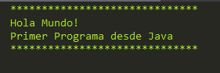

# Hola Mundo.

Lenguaje:
> Java

Funcion:

> Muestra un mensaje de Hola mundo en pantalla.

Codigo.

``` java
public class HolaMundo {
    public static void main(String[] args) {

        System.out.println("******************************");
        System.out.println("Hola Mundo!");
        System.out.println("Primer Programa desde Java");
        System.out.println("******************************");
    }
}

```
Resultado.

