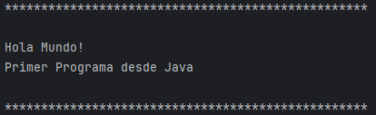

<p align="center">

</p>

<h1 align="center" id="holaMundo">HOLA MUNDO</h1>

## Insignias


## Índice

1. [Hola Mundo](#holaMundo)

2. [Insignias](#insignias)

3. [Índice](#índice)

4. [Descripción del proyecto](#descripción-del-proyecto)

5. [Estado del proyecto](#Estado-del-proyecto)

6. [Características de la aplicación y demostración](#Características-de-la-aplicación-y-demostración)

7. [Acceso al proyecto](#acceso-proyecto)

8. [Tecnologías utilizadas](#tecnologías-utilizadas)

9. [Personas-Desarrolladores del Proyecto](#personas-desarrolladores)

10. [Conclusión](#conclusión)

## Descripción del proyecto

Este es primer programa que muestra en pantalla en famoso saludo de Hola Mundo.

## Estado del proyecto

<h4 align="center">
FINALIZADO
</h4>

## Características de la aplicación y demostración.

> Lenguaje

    Java

> Uso

    -println

> Aplicacion de consola

Codigo.

```java
public class HolaMundo {
    public static void main(String[] args) {

        System.out.println("******************************");
        System.out.println("Hola Mundo!");
        System.out.println("Primer Programa desde Java");
        System.out.println("******************************");
    }
}

```

Resultado.



## Acceso al proyecto

[Github](https://github.com/Chinicuil87/programacionJava/tree/main/HolaMundo)

## Tecnologías utilizadas


## Personas-Desarrolladores del Proyecto

| [<br><sub>Cesar Lopez Orihuela</sub>](https://github.com/Chinicuil87)
