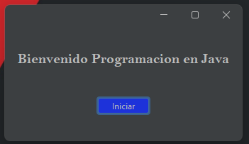
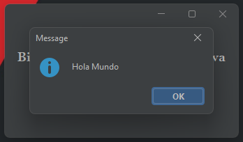

<h1 align="center" id="holaMundo">HOLA MUNDO</h1>

## Insignias

<section align="center" >

</section>

## Índice

1. [Hola Mundo](#holaMundo)

2. [Insignias](#insignias)

3. [Índice](#índice)

4. [Descripción del proyecto](#descripción-del-proyecto)

5. [Estado del proyecto](#Estado-del-proyecto)

6. [Características de la aplicación y demostración](#características-de-la-aplicación-y-demostración)

7. [Acceso al proyecto](#acceso-al-proyecto)

8. [Tecnologías utilizadas](#tecnologías-utilizadas)

9. [Personas-Desarrolladores del Proyecto](#desarrollador-del-proyecto)

10. [Redes Sociales](#redes-sociales)

## Descripción del proyecto

Aplicacion de Escritorio que muestra en pantalla el mensaje de Hola Mundo.

## Estado del proyecto

<h4 align="center">

</h4>

## Características de la aplicación y demostración.

> Lenguaje

    Java

> Tipo de Aplicacion.

    -Escritorio

> Resultado Escritorio.

## Acceso al proyecto

<section align="center">

</section>

## Tecnologías utilizadas

<section align="center">

</section>

## Desarrollador del Proyecto

<section align="center">

[ Cesar Lopez Orihuela](https://github.com/Chinicuil87)

</section>

## Redes Sociales

<section align="center">

</section>
