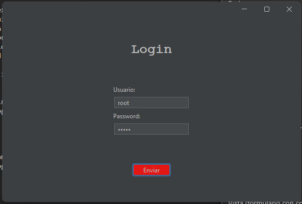
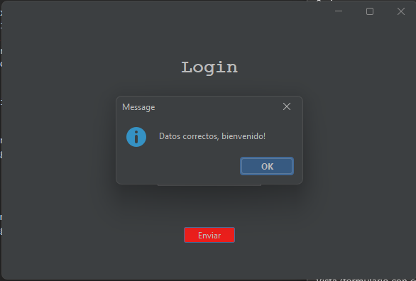

<h1 align="center" id="login">Login</h1>

## Insignias

<section align="center">

</section>

## Índice

1. [Login](#login)

2. [Insignias](#insignias)

3. [Índice](#índice)

4. [Descripción del proyecto](#descripción-del-proyecto)

5. [Estado del proyecto](#Estado-del-proyecto)

6. [Características de la aplicación y demostración](#Características-de-la-aplicación-y-demostración)

7. [Acceso al proyecto](#acceso-proyecto)

8. [Tecnologías utilizadas](#tecnologías-utilizadas)

9. [Personas-Desarrolladores del Proyecto](#personas-desarrolladores)

10. [Conclusión](#conclusión)

## Descripción del proyecto

Aplicacion de escritorio, el cual muestra en pantalla una ventana de login.
Se usa la paqueteria de Swins de Java, uno de botones y cuadros de texto.

## Estado del proyecto

<h4 align="center">
FINALIZADO
</h4>

## Características de la aplicación y demostración.

> Lenguaje

    - Java

> Dependencias.

    - Flatlaf

> Uso

    -Maven
    -Swing
    -JFrame

> Aplicacion de escritorio.

> Esquema de aplicacion

> Aplicacion Ejecucion

## Acceso al proyecto

[Github](https://github.com/Chinicuil87/programacionJava/tree/main/ZonaFit)

## Tecnologías utilizadas

<section align="center">

</section>

## Personas-Desarrolladores del Proyecto

<section align="center">

[ Cesar Lopez Orihuela](https://github.com/Chinicuil87)

</section>
