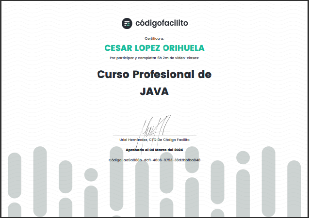
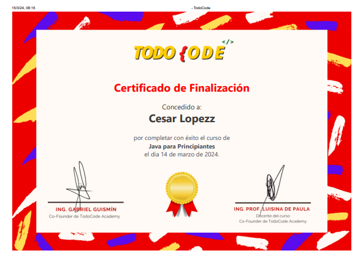

</img>

<h1 align="center" id="titulo">PROGRAMACION EN JAVA </h1>

Repositorio que contiene todos los proyectos y ejercicios hechos en Java durante los cursos, con la finalidad de brindar información de mis avances y habilidades adquiridas durante las certificaciones.

## Requisitos para programar en Java.

Requisitos minimos de equipo de computo.

<section align="center">

</section>

> Windows  
> Windows 10 (7u85 y superiores)  
> Windows 8.x (escritorio)  
> Windows 7 SP1  
> Windows Vista SP2  
> Windows Server 2008 SP2 y 2008 R2 SP1 (64 bits)  
> Windows Server 2012 (64 bits) y 2012 R2 (64 bits)  
> RAM: 128 MB; 64 MB para Windows XP (32 bits)  
> Espacio en disco: 124 MB  
> Exploradores: Internet Explorer 7.0 y superior, Firefox 3.6 y superior

> Mac OS X  
> Mac con Intel que ejecuta Mac OS X 10.7.3+, 10.8.3+, 10.9+  
> Privilegios de administrador para la instalación  
> Explorador de 64 bits  
> Se requiere un explorador de 64 bits (Safari, por ejemplo) para ejecutar Oracle Java en Mac.

> Linux  
> Oracle Linux 5.5+  
> Oracle Linux 6.x (32 bits), 6.x (64 bits)3  
> Oracle Linux 7.x (64 bits)3 (7u67 y superiores)  
> Red Hat Enterprise Linux 5.5+, 6.x (32 bits), 6.x (64 bits)3  
> Red Hat Enterprise Linux 7.x (64 bits)3 (7u67 y superiores)  
> Suse Linux Enterprise Server 10 SP2, 11.x  
> Suse Linux Enterprise Server 12.x (7u75 y superiores)  
> Ubuntu Linux 10.04 y superiores  
> Exploradores: Firefox 3.6 y posterior

> [Saber mas.](https://www.java.com/es/download/help/sysreq_es.html)

## Programas.

<section align="center">

</section>

[1. JDK (Java Development Kit)](https://www.oracle.com/mx/java/technologies/downloads/)

[2. IDE ](https://aws.amazon.com/es/what-is/ide/)  
 [- Intellij](https://www.jetbrains.com/idea/download/?section=windows)  
 [- NetBeans](https://netbeans.apache.org/front/main/download/)

## Cursos y plataformas.

> Codigo Facilito  
> [Curso Profesional de JAVA (FINALIZADO)](https://codigofacilito.com/cursos/java-profesional)

> Udemy  
> [Universidad Java - Cero a Experto - Actualizado (+150 hrs) (PROCESO) ](https://www.udemy.com/course/universidad-java-especialista-en-java-desde-cero-a-master/?couponCode=KEEPLEARNING)

> TODO{ODE  
>  [Java para Principiantes (FINALIZDO)](https://todocodeacademy.com/course/java-para-principiantes/)

<section align="center">

</section>

## Profesores

Udemy.
Ing. Ubaldo Acosta

YouTube
Ing. Prof. Luisina de Paula

Codigo Facilito
Ing. Eduardo Ismael Garcia

## Certificados.

[  Curso Profesional de JAVA ](https://codigofacilito.com/certificates/aa9a888b-dcf1-4606-9753-38d2bbfba848)

[  Java para Principiantes ](https://todocodeacademy.com/certificate/k1a/)

## Practicas y ejercicios.

A. General

B. Udemy

C. YouTube

[Hola Mundo!](HolaMundo)

[Saludo Usuario](SaludoUsuario)

[Presentandome](Persentandome)

[Detalle Persona](DetallePersona)

[Detalle de Producto](Producto)

[Calculadora](CalculadoraApp)

[Cuenta Bancaria](CuentaBancaria)

[Numero Secreto](NumeroSecreto)

[Lista de Personas](ListaPersonas)

[Catalogo de Peliculas](CatalogoPeliculasApp)

[Venta de Computadoras](VentaComputadoras)

## Personas-Desarrolladores del Proyecto

<section align="center">

[ Cesar Lopez Orihuela](https://github.com/Chinicuil87)

</section>
