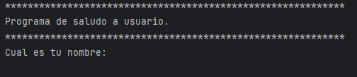
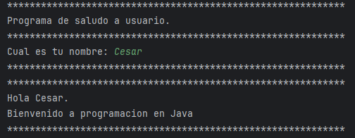

<h1 align="center" id="Información">Saludo Usuario</h1>

## Insignias

<section align="center">

</section>

## Índice

1. [Saludo a Usuario](#Información)

2. [Insignias](#insignias)

3. [Índice](#índice)

4. [Descripción del proyecto](#descripción-del-proyecto)

5. [Estado del proyecto](#Estado-del-proyecto)

6. [Características de la aplicación y demostración](#Características-de-la-aplicación-y-demostración)

7. [Acceso al proyecto](#acceso-proyecto)

8. [Tecnologías utilizadas](#tecnologías-utilizadas)

9. [Personas-Desarrolladores del Proyecto](#desarrollador-del-proyecto)

10. [Redes Sociales](#redes-sociales)

## Descripción del proyecto

Aplicacion de consola que solicita al usuario su nombre y muestra un saludo personalizado.

## Estado del proyecto

<h4 align="center">
FINALIZADO
</h4>

## Características de la aplicación y demostración.

> Lenguaje

    Java

> Uso

    -println
    -scanner
    -variables

> Aplicacion de consola

Resultado.

> Solicitar ingresar datos.

> Muestra salido personalizado

## Acceso al proyecto

## Tecnologías utilizadas

<section align="center">

  

</section>

## Tecnologías utilizadas

<section align="center">

</section>

## Desarrollador del Proyecto

<section align="center">

[ Cesar Lopez Orihuela](https://github.com/Chinicuil87)

</section>

## Redes Sociales

<section align="center">

</section>
